# 🚀 Azure Service Bus Queues for MCP: Complete Developer Guide

## 📋 Table of Contents

1. [Introduction: Why Queues in MCP?](#introduction)
2. [Core Concepts](#concepts)
3. [Real-World Use Cases](#use-cases)
4. [Architecture Patterns](#patterns)
5. [Practical Examples](#examples)
6. [Advanced Workflows](#workflows)
7. [Integrations & Ecosystem](#integrations)
8. [Best Practices](#best-practices)
9. [Troubleshooting](#troubleshooting)
10. [Evolution & Roadmap](#evolution)

---

## 🎯 Introduction: Why Queues in MCP? {#introduction}

### The LLM Time Constraint Challenge

Large Language Models (LLMs) like Claude face significant temporal constraints:

- ⏱️ **Timeouts**: Requests have strict time limits (30s-2min)
- 🔄 **Synchronous**: LLM waits for response before continuing
- 💭 **Context**: Each interaction must be complete and immediate

### How Queues Transform the Equation

**Azure Service Bus Queues** enable us to **transcend these limitations**:

- 🚀 **Asynchronous**: Trigger long-running tasks without waiting
- 🔗 **Persistence**: Tasks survive sessions and restarts
- 📈 **Scalability**: Parallel processing and load distribution
- 🎭 **Orchestration**: Complex multi-step workflows

### Vision: The Augmented AI Assistant

Imagine Claude that can:

- 📊 Analyze multi-GB datasets in the background
- 🤖 Coordinate multiple specialized agents
- ⏰ Schedule recurring tasks
- 🔄 Manage complex business workflows
- 🌐 Integrate with external systems

**This is exactly what MCP queues make possible!**

---

## 🧠 Core Concepts {#concepts}

### MCP + Queues Architecture


### Key Differences: MCP vs Traditional Architecture

| Aspect | Traditional Architecture | MCP with Queues |
|--------|--------------------------|-----------------|
| **Initiator** | Applications/Developers | AI/LLM |
| **Planning** | Static, predefined | Dynamic, contextual |
| **Logic** | Hard-coded | AI-generated |
| **Adaptation** | Code changes | Prompts and context |
| **Complexity** | Human-managed | AI-managed |

### Queue Types in MCP Context

#### 1. **Task Queues**

```json
{
  "queueName": "ai-tasks",
  "purpose": "Asynchronous processing requested by AI"
}
```

#### 2. **Agent Communication Queues**

```json
{
  "queueName": "agent-coordination", 
  "purpose": "Communication between different AI agents"
}
```

#### 3. **Workflow Queues**

```json
{
  "queueName": "business-workflows",
  "purpose": "Complex business process steps"
}
```

#### 4. **Event Queues**

```json
{
  "queueName": "system-events",
  "purpose": "Event notifications and reactions"
}
```

---

## 💡 Real-World Use Cases {#use-cases}

### 🎯 Use Case 1: Large-Scale Data Analysis

**Problem:** Claude receives a 500MB dataset to analyze
**Traditional Solution:** ❌ Timeout after 2 minutes
**Queue Solution:** ✅ Complete asynchronous processing

```bash
# Step 1: Claude triggers analysis
send-queue-message {
  "queueName": "data-analysis",
  "messageBody": "{
    \"file\": \"sales-data-2024.csv\",
    \"analysis\": \"quarterly-trends\",
    \"output\": \"quarterly-report-2024\"
  }",
  "correlationId": "analysis-session-123"
}

# Step 2: Claude continues other tasks
# Step 3: Periodic checking
peek-queue-message {"queueName": "analysis-results"}

# Step 4: Retrieve results
read-azure-blob {
  "containerName": "analysis-results",
  "blobName": "quarterly-report-2024.json"
}
```

**Value delivered:**

- ⏱️ No timeout constraints
- 🔄 Claude can multitask during analysis
- 📊 Complete and detailed results
- 🎯 Optimized processing for large volumes

### 🤖 Use Case 2: Multi-Agent Coordination

**Problem:** Complex project requiring multiple AI specialists
**Solution:** Multi-agent architecture coordinated by queues

```bash
# Claude Principal delegates to specialized agents

# Research Agent
send-queue-message {
  "queueName": "research-tasks",
  "messageBody": "{
    \"task\": \"market-research\",
    \"topic\": \"Cloud storage pricing 2024\",
    \"scope\": \"AWS, Azure, GCP comparison\"
  }",
  "sessionId": "project-analysis-456"
}

# Data Analyst Agent
send-queue-message {
  "queueName": "analysis-tasks",
  "messageBody": "{
    \"task\": \"cost-analysis\",
    \"data_source\": \"billing-data-2024\",
    \"focus\": \"storage-costs\"
  }",
  "sessionId": "project-analysis-456"
}

# Report Writer Agent
send-queue-message {
  "queueName": "writing-tasks", 
  "messageBody": "{
    \"task\": \"executive-summary\",
    \"inputs\": [\"research-results\", \"analysis-results\"],
    \"format\": \"executive-presentation\"
  }",
  "sessionId": "project-analysis-456"
}

# Coordination and result collection
receive-queue-message {"queueName": "completed-tasks"}
```

**Value delivered:**

- 🎭 Domain specialization
- ⚡ Parallel processing
- 🎯 Quality optimized by specialist
- 🔄 Intelligently orchestrated workflow

### 📅 Use Case 3: Complex Business Workflows

**Problem:** Customer onboarding process with multiple steps
**Solution:** AI-orchestrated workflow with queues

```bash
# Workflow: Customer Onboarding
# Step 1: Initial validation
send-queue-message {
  "queueName": "onboarding-workflow",
  "messageBody": "{
    \"step\": \"validate-documents\",
    \"client_id\": \"CLIENT_789\",
    \"documents\": [\"id_card\", \"contract\", \"bank_details\"]
  }",
  "correlationId": "onboarding-CLIENT_789"
}

# Worker processes → If success, automatically sends next step
# Step 2: Account creation (automatic after validation)
{
  "step": "create-accounts",
  "client_id": "CLIENT_789", 
  "account_types": ["storage", "compute", "network"]
}

# Step 3: Initial configuration
{
  "step": "initial-setup",
  "client_id": "CLIENT_789",
  "config": "standard-tier"
}

# Step 4: Notification and documentation
{
  "step": "welcome-package",
  "client_id": "CLIENT_789",
  "send_credentials": true
}
```

**Value delivered:**

- 🔄 Failure-resilient workflow
- ✅ Validation at each step
- 📋 Complete traceability
- 🎯 Business logic in AI, not code

### 🌐 Use Case 4: Legacy System Integration

**Problem:** Integrate with legacy systems (ERP, legacy CRM)
**Solution:** Queues as bridge between modern AI and legacy systems

```bash
# Claude requests legacy data
send-queue-message {
  "queueName": "legacy-integration",
  "messageBody": "{
    \"system\": \"SAP-ERP\",
    \"query\": \"customer-orders-2024\",
    \"customer_id\": \"CUST_456\",
    \"format\": \"json\"
  }",
  "timeToLive": 300000  // 5 minutes max
}

# Specialized worker handles Legacy → Modern translation
# Result available in Azure Storage
# Claude retrieves and continues analysis
```

**Value delivered:**

- 🌉 Bridge AI ↔ Legacy
- 🔄 Automated data transformation
- 📡 System decoupling
- ⚡ Progressive modernization

---

## 🏗️ Architecture Patterns {#patterns}

### Pattern 1: Fire-and-Forget (Asynchronous Task)

```mermaid
sequenceDiagram
    participant C as Claude
    participant Q as Queue
    participant W as Worker
    participant S as Storage
    
    C->>Q: send-message (task)
    Q->>C: ✅ Message queued
    Note over C: Continue other tasks
    Q->>W: deliver message
    W->>W: process task
    W->>S: store results
    Note over C: Later...
    C->>S: read results
```



**When to use:**

- Compute-intensive tasks
- Large file processing
- Operations taking > 30 seconds

### Pattern 2: Asynchronous Request-Response


**When to use:**

- Slow external APIs
- Complex calculations with expected result
- Third-party system integrations

### Pattern 3: Multi-Step Pipeline


**When to use:**

- Complex workflows
- ETL processing
- Multi-level validation

### Pattern 4: Fan-Out/Fan-In (Distribute then Aggregate)


**When to use:**

- Parallel processing
- Multi-source data aggregation
- Distributed search

---

## 🛠️ Practical Examples {#examples}

### Example 1: Business Intelligence Assistant

```bash
# Scenario: Claude analyzes business performance

# 1. Claude identifies need for deep analysis
echo "I'll analyze your Q4 2024 KPIs. This will take a few minutes..."

# 2. Trigger analysis
send-queue-message {
  "queueName": "bi-analysis",
  "messageBody": "{
    \"period\": \"Q4-2024\",
    \"metrics\": [\"revenue\", \"churn\", \"acquisition\", \"cac\"],
    \"segments\": [\"enterprise\", \"smb\", \"startup\"],
    \"output_format\": \"executive-dashboard\"
  }",
  "correlationId": "bi-analysis-$(date +%s)"
}

# 3. During processing, Claude can answer other questions
echo "Meanwhile, what else would you like to know?"

# 4. Periodic checking (every 30s)
while true; do
  result=$(peek-queue-message '{"queueName": "bi-results"}')
  if [[ $result == *"executive-dashboard"* ]]; then
    break
  fi
  sleep 30
done

# 5. Present results
read-azure-blob {
  "containerName": "bi-results",
  "blobName": "executive-dashboard-Q4-2024.json"
}

echo "✅ Analysis complete! Here are your Q4 KPIs..."
```

### Example 2: Automated Documentation Generator

```bash
# Scenario: Complete project documentation

# 1. Claude analyzes project structure
send-queue-message {
  "queueName": "doc-generation",
  "messageBody": "{
    \"project_path\": \"/repos/my-project\",
    \"doc_types\": [\"api\", \"architecture\", \"deployment\", \"user-guide\"],
    \"format\": \"markdown\",
    \"include_diagrams\": true
  }",
  "sessionId": "doc-project-xyz"
}

# 2. Parallel generation of each doc type
# Worker 1: API Documentation
# Worker 2: Architecture Diagrams  
# Worker 3: Deployment Guide
# Worker 4: User Manual

# 3. Aggregation and complete site generation
send-queue-message {
  "queueName": "doc-assembly",
  "messageBody": "{
    \"action\": \"compile-site\",
    \"inputs\": [\"api-docs\", \"arch-docs\", \"deploy-docs\", \"user-docs\"],
    \"template\": \"corporate\"
  }",
  "sessionId": "doc-project-xyz"
}

# 4. Automatic publishing
send-queue-message {
  "queueName": "doc-publishing",
  "messageBody": "{
    \"action\": \"publish\",
    \"target\": \"github-pages\",
    \"domain\": \"docs.myproject.com\"
  }",
  "sessionId": "doc-project-xyz"
}
```

### Example 3: Intelligent Monitoring and Alerting

```bash
# Scenario: Claude monitors infrastructure and reacts to anomalies

# 1. Configure continuous monitoring
send-queue-message {
  "queueName": "monitoring-setup",
  "messageBody": "{
    \"action\": \"start-monitoring\",
    \"targets\": [\"cpu\", \"memory\", \"disk\", \"network\", \"application\"],
    \"thresholds\": {\"cpu\": 80, \"memory\": 85, \"disk\": 90},
    \"check_interval\": 60
  }",
  "sessionId": "monitoring-prod"
}

# 2. Monitoring worker publishes metrics to event queue
# Automatic messages like:
{
  "event": "threshold_exceeded",
  "metric": "cpu_usage", 
  "value": 85,
  "threshold": 80,
  "severity": "warning",
  "timestamp": "2024-01-05T10:30:00Z"
}

# 3. Claude receives alerts and analyzes
receive-queue-message {"queueName": "monitoring-alerts"}

# 4. Intelligent decision and automatic action
send-queue-message {
  "queueName": "auto-scaling",
  "messageBody": "{
    \"action\": \"scale-up\",
    \"service\": \"web-servers\",
    \"reason\": \"cpu_threshold_exceeded\",
    \"scale_factor\": 1.5
  }"
}

# 5. Team notification
send-queue-message {
  "queueName": "notifications",
  "messageBody": "{
    \"channel\": \"slack-ops\",
    \"message\": \"🚨 Auto-scaling triggered: CPU usage 85% → Added 2 web servers\",
    \"priority\": \"medium\"
  }"
}
```

---

## 🔄 Advanced Workflows {#workflows}

### Workflow 1: Complete DevOps Pipeline

```bash
# Triggered by Claude: "Deploy the new version"

# Step 1: Automated tests
send-queue-message {
  "queueName": "ci-pipeline",
  "messageBody": "{
    \"step\": \"run-tests\",
    \"branch\": \"feature/new-api\",
    \"test_suites\": [\"unit\", \"integration\", \"e2e\"]
  }",
  "correlationId": "deploy-v2.1.0"
}

# If tests OK → Step 2: Build and package
{
  "step": "build",
  "target": "production",
  "optimize": true
}

# If build OK → Step 3: Staging deployment
{
  "step": "deploy-staging",
  "environment": "staging",
  "health_checks": true
}

# If staging OK → Step 4: Performance tests
{
  "step": "performance-tests",
  "duration": "5min",
  "load_pattern": "realistic"
}

# If perf OK → Step 5: Production deployment
{
  "step": "deploy-production", 
  "strategy": "blue-green",
  "rollback_enabled": true
}

# Step 6: Post-deployment monitoring
{
  "step": "post-deploy-monitoring",
  "duration": "30min",
  "auto_rollback": true
}
```

### Workflow 2: Automated Incident Response

```bash
# Incident detected by monitoring

# Step 1: Automatic incident analysis
send-queue-message {
  "queueName": "incident-response",
  "messageBody": "{
    \"step\": \"analyze-incident\",
    \"symptoms\": [\"high_latency\", \"error_rate_spike\"],
    \"affected_services\": [\"api-gateway\", \"user-service\"],
    \"severity\": \"high\"
  }",
  "priority": "urgent"
}

# Step 2: Collect diagnostics
{
  "step": "collect-diagnostics",
  "data_sources": ["logs", "metrics", "traces"],
  "time_window": "last_30min"
}

# Step 3: Root cause identification
{
  "step": "root-cause-analysis", 
  "ai_analysis": true,
  "historical_data": true
}

# Step 4: Automatic corrective actions
{
  "step": "auto-remediation",
  "actions": ["restart_service", "scale_up", "failover"],
  "approval_required": false  // For critical incidents
}

# Step 5: Stakeholder communication
{
  "step": "incident-communication",
  "channels": ["status_page", "slack", "email"],
  "update_frequency": "5min"
}

# Step 6: Automatic post-mortem
{
  "step": "generate-postmortem",
  "include_timeline": true,
  "action_items": true,
  "lessons_learned": true
}
```

### Workflow 3: Continuous Cost Optimization

```bash
# Claude continuously analyzes and optimizes costs

# Step 1: Current cost analysis
send-queue-message {
  "queueName": "cost-optimization",
  "messageBody": "{
    \"step\": \"cost-analysis\",
    \"period\": \"last_30_days\",
    \"granularity\": \"service_level\",
    \"include_forecasting\": true
  }",
  "sessionId": "cost-opt-monthly"
}

# Step 2: Identify optimizations
{
  "step": "find-optimizations",
  "focus_areas": ["unused_resources", "oversized_instances", "storage_tiers"],
  "potential_savings_threshold": 100  // $100/month minimum
}

# Step 3: Simulate changes
{
  "step": "simulate-changes",
  "optimization_proposals": ["downsize_dev_env", "reserved_instances", "storage_lifecycle"],
  "risk_assessment": true
}

# Step 4: Implement safe optimizations
{
  "step": "auto-implement",
  "risk_level": "low",  // Only risk-free changes
  "backup_config": true
}

# Step 5: Report and recommendations
{
  "step": "generate-report",
  "savings_achieved": true,
  "manual_recommendations": true,
  "next_review_date": true
}
```

---

## 🔌 Integrations & Ecosystem {#integrations}

### Azure Ecosystem Integration

#### 1. **Azure Functions + Queues**

```bash
# Claude triggers Azure Function via queue
send-queue-message {
  "queueName": "azure-functions",
  "messageBody": "{
    \"function_name\": \"ProcessImageAI\",
    \"input_blob\": \"raw-images/photo-123.jpg\",
    \"operations\": [\"face_detection\", \"object_recognition\", \"text_extraction\"]
  }"
}
```

#### 2. **Logic Apps Orchestration**

```bash
# Integration with Azure Logic Apps for complex workflows
send-queue-message {
  "queueName": "logic-apps-trigger",
  "messageBody": "{
    \"workflow\": \"CustomerOnboarding\",
    \"customer_data\": {...},
    \"approval_required\": false
  }"
}
```

#### 3. **Power Platform Integration**

```bash
# Trigger Power Automate flows
send-queue-message {
  "queueName": "power-automate",
  "messageBody": "{
    \"flow_name\": \"CreateCustomerRecord\",
    \"trigger_data\": {...},
    \"notification_email\": \"admin@company.com\"
  }"
}
```

### Multi-Cloud Integration

#### 1. **AWS Services Bridge**

```bash
# Claude orchestrates AWS services via queue
send-queue-message {
  "queueName": "aws-integration",
  "messageBody": "{
    \"service\": \"lambda\",
    \"function_name\": \"ProcessDataAWS\",
    \"cross_cloud_data\": \"azure-blob://data/input.json\"
  }"
}
```

#### 2. **Google Cloud Integration**

```bash
# Using GCP AI services
send-queue-message {
  "queueName": "gcp-ai-services",
  "messageBody": "{
    \"service\": \"vision_api\",
    \"operation\": \"document_text_detection\",
    \"input_storage\": \"azure\",
    \"output_storage\": \"azure\"
  }"
}
```

### Development Tools Integration

#### 1. **GitHub Actions**

```bash
# Claude triggers GitHub Actions
send-queue-message {
  "queueName": "github-actions",
  "messageBody": "{
    \"repository\": \"company/main-app\",
    \"workflow\": \"deploy-production\",
    \"branch\": \"main\",
    \"environment\": \"production\"
  }"
}
```

#### 2. **Slack/Teams Integration**

```bash
# Intelligent notifications
send-queue-message {
  "queueName": "team-notifications",
  "messageBody": "{
    \"platform\": \"slack\",
    \"channel\": \"#dev-team\",
    \"message\": \"🚀 Deployment successful! New features: [...]\",
    \"interactive\": true,
    \"actions\": [\"view_metrics\", \"rollback\"]
  }"
}
```

---

## ✅ Best Practices {#best-practices}

### 🎯 Message Design

#### 1. **Standard Structure**

```json
{
  "messageBody": "{
    \"version\": \"1.0\",
    \"type\": \"task_request\",
    \"timestamp\": \"2024-01-05T10:30:00Z\",
    \"data\": {
      \"operation\": \"analyze_data\",
      \"parameters\": {...}
    },
    \"metadata\": {
      \"source\": \"claude-mcp\",
      \"priority\": \"normal\",
      \"estimated_duration\": \"5min\"
    }
  }",
  "correlationId": "session-123-task-456",
  "userProperties": {
    "source": "mcp-server",
    "version": "1.0.2"
  }
}
```

#### 2. **Naming Conventions**

```bash
# Queues by function
"ai-tasks"           # Generic AI tasks
"data-processing"    # Data processing
"agent-coordination" # Inter-agent communication
"system-events"      # System events

# Messages with prefixes
"task-analysis-data-2024"
"event-user-login-success"
"alert-cpu-threshold-exceeded"
```

### ⚡ Performance and Reliability

#### 1. **Timeout Management**

```json
{
  "timeToLive": 1800000,  // 30 minutes for normal tasks
  "timeToLive": 7200000,  // 2 hours for complex analysis
  "timeToLive": 300000    // 5 minutes for critical tasks
}
```

#### 2. **Dead Letter Queue Configuration**

```json
{
  "deadLetteringOnMessageExpiration": true,
  "maxDeliveryCount": 3  // Retry 3 times before dead letter
}
```

#### 3. **Monitoring and Alerting**

```bash
# Regular queue health checks
get-azure-queue-properties {"queueName": "ai-tasks"}

# Alerts on message accumulation
if (messageCount > 100) {
  send-alert("Queue congestion detected")
}
```

### 🔒 Security and Governance

#### 1. **Sensitive Data**

```json
{
  "messageBody": "{
    \"data_reference\": \"azure-blob://secure/encrypted-data-123.enc\",
    \"encryption_key_ref\": \"key-vault://data-key-123\",
    \"access_policy\": \"restricted\"
  }"
}
```

#### 2. **Audit Trail**

```json
{
  "userProperties": {
    "user_session": "claude-session-789",
    "audit_id": "audit-2024-001234",
    "security_context": "standard-user"
  }
}
```

### 📊 Monitoring and Observability

#### 1. **Key Metrics**

- **Queue Depth**: Number of pending messages
- **Processing Time**: Average processing duration
- **Error Rate**: Message failure rate
- **Throughput**: Messages processed per second

#### 2. **Structured Logging**

```json
{
  "timestamp": "2024-01-05T10:30:00Z",
  "level": "INFO",
  "source": "mcp-queue-handler",
  "message": "Task completed successfully",
  "metadata": {
    "queue_name": "ai-tasks",
    "correlation_id": "session-123-task-456",
    "processing_time_ms": 45000,
    "result_size_kb": 256
  }
}
```

---

## 🔧 Troubleshooting {#troubleshooting}

### Common Issues and Solutions

#### 1. **Messages Stuck in Queue**

**Symptoms:**

- Messages accumulate without processing
- `peek-queue-message` shows old messages

**Possible Causes:**

- Worker down or overloaded
- Malformed messages
- External dependencies unavailable

**Solutions:**

```bash
# Diagnosis
get-azure-queue-properties {"queueName": "problematic-queue"}
peek-queue-message {"queueName": "problematic-queue", "maxMessageCount": 5}

# Corrective actions
# 1. Restart workers
send-queue-message {
  "queueName": "admin-commands",
  "messageBody": "{\"action\": \"restart-workers\", \"queue\": \"problematic-queue\"}"
}

# 2. Purge corrupted messages (if necessary)
# 3. Scale up workers if overloaded
```

#### 2. **Message Timeouts**

**Symptoms:**

- Messages expire before processing
- Dead letter queue fills up

**Solutions:**

```json
{
  "timeToLive": 3600000,  // Increase TTL
  "maxDeliveryCount": 5,   // More retry attempts
  "lockDuration": "PT60S"  // More processing time
}
```

#### 3. **Lost Correlation**

**Symptoms:**

- Cannot match responses to requests
- Lost sessions

**Solutions:**

```json
{
  "correlationId": "claude-session-${timestamp}-${random}",
  "sessionId": "stable-session-identifier",
  "userProperties": {
    "original_request_id": "req-123",
    "claude_context": "conversation-context"
  }
}
```

#### 4. **Performance Degradation**

**Diagnosis:**

```bash
# Check all queues
list-azure-queues

# Analyze each problematic queue
for queue in $(echo $problem_queues); do
  get-azure-queue-properties "{\"queueName\": \"$queue\"}"
done

# Check message patterns
peek-queue-message {"queueName": "slow-queue", "maxMessageCount": 10}
```

**Optimizations:**

- Batch message processing
- Worker parallelization
- Data query optimization
- Frequent result caching

### Debug and Diagnostics

#### 1. **Message Tracing**

```json
{
  "messageBody": "{
    \"trace_id\": \"trace-2024-001234\",
    \"span_id\": \"span-456\",
    \"parent_span\": \"span-123\",
    \"operation\": \"data-analysis\"
  }",
  "userProperties": {
    "trace_enabled": "true",
    "debug_level": "verbose"
  }
}
```

#### 2. **Health Checks**

```bash
# Global system verification
send-queue-message {
  "queueName": "health-checks",
  "messageBody": "{
    \"check_type\": \"full_system\",
    \"components\": [\"queues\", \"workers\", \"storage\", \"network\"]
  }"
}
```

---

## 🚀 Evolution & Roadmap {#evolution}

### Advanced Features Coming Soon

#### Phase 3: Augmented Intelligence (Q2 2025)

##### 1. **Intelligent Auto-Scaling**

```json
{
  "feature": "intelligent-scaling",
  "description": "Queues automatically adapt to load",
  "capabilities": [
    "History-based load prediction",
    "Predictive scaling before peaks",
    "Automatic cost/performance optimization"
  ]
}
```

##### 2. **Smart Message Routing**

```json
{
  "feature": "smart-routing", 
  "description": "AI automatically determines best queue/worker",
  "capabilities": [
    "Message content analysis",
    "Specialization-based routing",
    "Intelligent load balancing"
  ]
}
```

##### 3. **Self-Healing Workflows**

```json
{
  "feature": "self-healing-workflows",
  "description": "Automatic problem detection and correction",
  "capabilities": [
    "Real-time anomaly detection",
    "Automatic broken workflow correction",
    "Error pattern learning"
  ]
}
```

#### Phase 4: Extended Ecosystem (Q3 2025)

##### 1. **Multi-Cloud Queue Federation**

```json
{
  "feature": "multi-cloud-queues",
  "description": "Distributed queues across clouds",
  "capabilities": [
    "Azure Service Bus + AWS SQS + GCP Pub/Sub",
    "Automatic cross-cloud failover", 
    "Multi-cloud cost optimization"
  ]
}
```

##### 2. **Integration Marketplace**

```json
{
  "feature": "integration-marketplace",
  "description": "Marketplace of pre-built integrations",
  "integrations": [
    "Salesforce", "HubSpot", "Shopify",
    "GitHub", "Jira", "Confluence",
    "ServiceNow", "Datadog", "New Relic"
  ]
}
```

##### 3. **Visual Workflow Designer**

```json
{
  "feature": "visual-workflows",
  "description": "Graphical interface for workflow design",
  "capabilities": [
    "Drag-and-drop workflow design",
    "Real-time workflow monitoring",
    "A/B testing of workflows"
  ]
}
```

### Migration and Compatibility

#### Backward Compatibility Promise

- **API Stability**: Current APIs remain supported
- **Message Format**: Backward compatibility guaranteed
- **Migration Tools**: Automatic migration utilities

#### Upgrade Path

```bash
# Automatic migration to new features
send-queue-message {
  "queueName": "system-upgrade",
  "messageBody": "{
    \"action\": \"enable-smart-routing\",
    \"queues\": [\"ai-tasks\", \"data-processing\"],
    \"migration_strategy\": \"gradual\",
    \"rollback_enabled\": true
  }"
}
```

### Success Metrics

#### Current KPIs (v1.0.2)

- ✅ **Reliability**: 99.9% message delivery
- ✅ **Performance**: < 100ms queue latency  
- ✅ **Scalability**: 10K messages/minute
- ✅ **Integration**: 3 Azure services

#### v2.0 Targets (Q4 2025)

- 🎯 **Reliability**: 99.99% message delivery
- 🎯 **Performance**: < 50ms queue latency
- 🎯 **Scalability**: 100K messages/minute  
- 🎯 **Integration**: 15+ services/platforms

---

## 🎉 Conclusion

**Azure Service Bus Queues in MCP** transform Claude from a conversational assistant into an **intelligent orchestrator** capable of:

### 🎯 **Transformational Capabilities**

- 🚀 **Transcend LLM time limitations**
- 🎭 **Coordinate complex ecosystems** 
- 🔄 **Orchestrate sophisticated business workflows**
- 🌐 **Integrate legacy and modern systems**
- 📊 **Process enterprise-scale data**

### 💡 **Business Value**

- **Immediate ROI**: Complex task automation
- **Scalability**: Growth without architectural rework  
- **Reliability**: Failure-resilient workflows
- **Innovation**: New AI usage possibilities

### 🔮 **Future Vision**

Claude will no longer be just an assistant, but an **intelligent conductor** that:

- Understands business needs
- Designs optimal workflows
- Orchestrates automatic execution
- Continuously adapts and learns

**MCP queues aren't just a technical feature - they're the foundation of a new era of enterprise artificial intelligence.** 🚀

---

*This guide will evolve with your feedback and new features. Feel free to contribute with your use cases and suggestions!*